## PROJECT 6: Web Solution With WordPress

To begin with, I launched two EC2 instances using Redhat (not Ubuntu). One instance will serve as the 'Web Server' while the other will serve as the 'Database Server'.

___
## **STEP 1 — PREPARING THE WEB SERVER**
___

Firstly, I created 3 volumes in the same AZ (Availability Zone) as my Web Server EC2, each of 10 GiB and respectively name web1, web2 and web3.

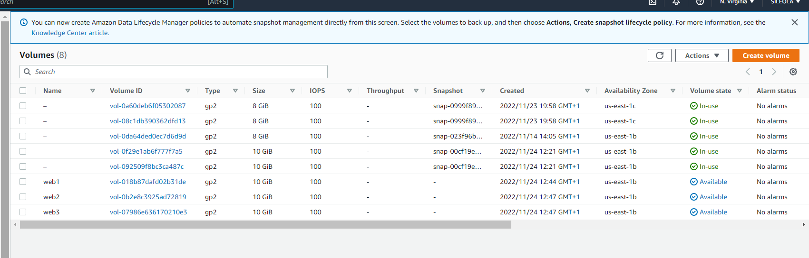

Next, I attached all three volumes one by one to the Web Server EC2 instance, as displayed below:

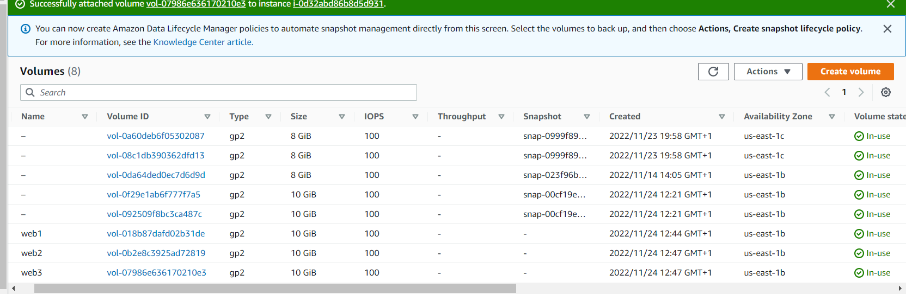

From my webserver instance, I ran the command below to confirm that my volumes have been successfully attached:

`lsblk`

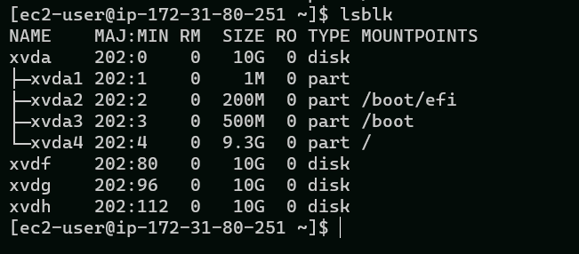

To see all (available) mount points and free space on my server, I ran this command:

`df -h`

The output is displayed below:

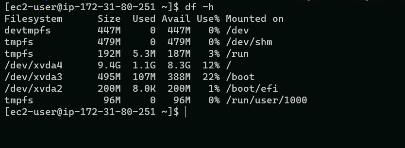

Next, I used the *gdisk* utility to create a single partition on each of the 3 disks, beginning with the first volume, using the command below:

`sudo gdisk /dev/xvdf`

The configuration is displayed below:

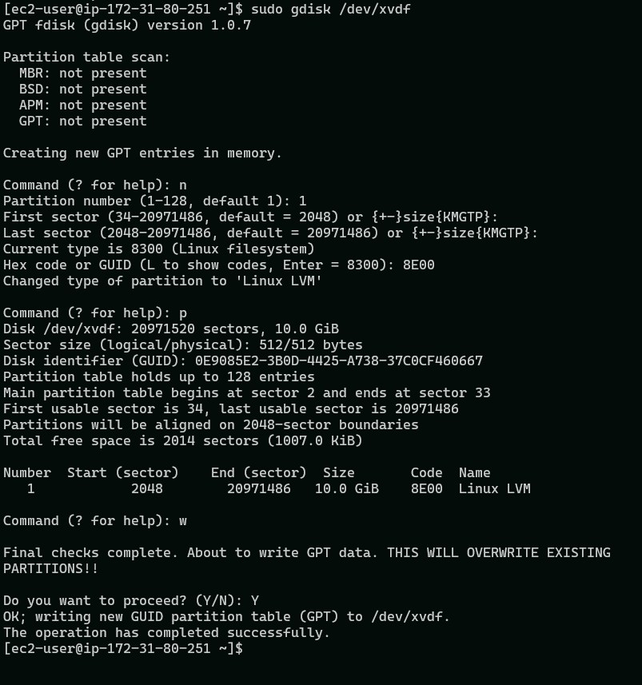

I repeated the last step for the *xvdg disk*, as below:

`sudo gdisk /dev/xvdg`

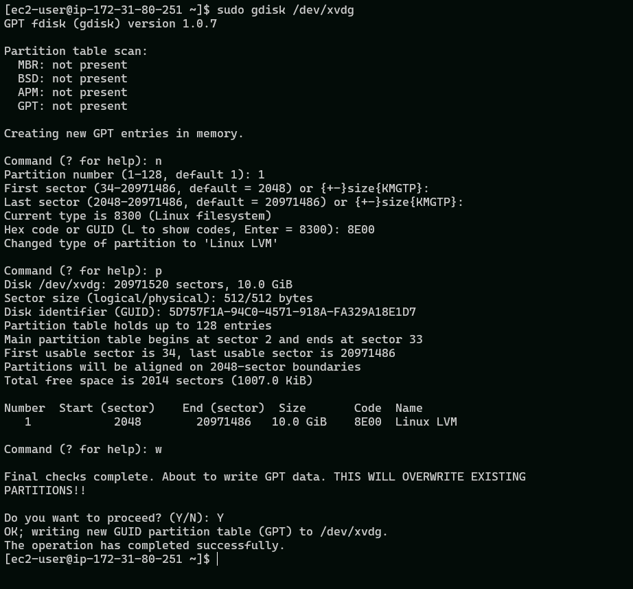

Similarly, the previous step was repeated the *xvdh disk*, as below:

`sudo gdisk /dev/xvdh`

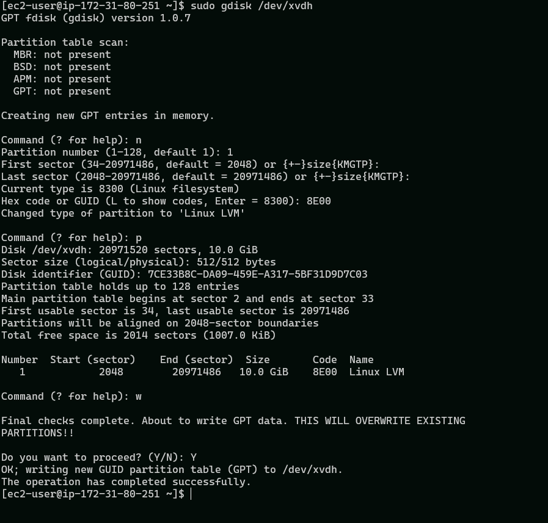

Next, I used the *lsblk utility* to view the newly configured partition on each of the 3 disks. This is displayed below:

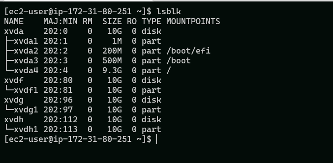

Next, I installed *lvm2* package using sudo yum install lvm2 by running the command below

`sudo yum install lvm2 -y`

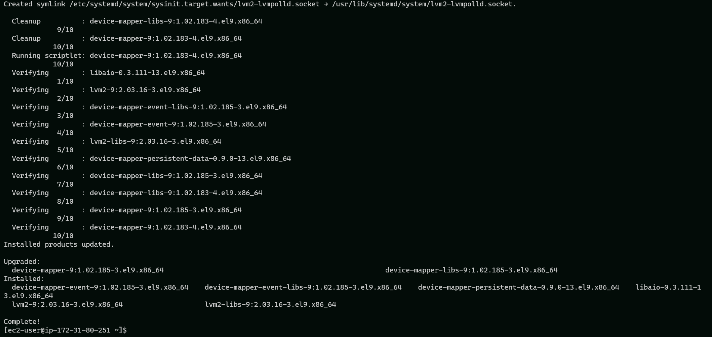

To check for available partitions, I ran the command below:

`sudo lvmdiskscan`

The output is shown below:

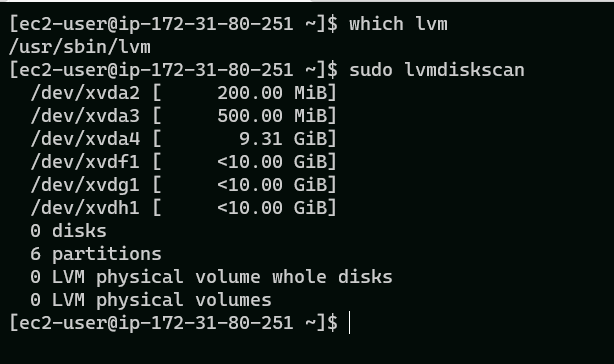

Next, I used the *pvcreate* utility to mark each of 3 disks as physical volumes (PVs) to be used by LVM

`sudo pvcreate /dev/xvdf1 /dev/xvdg1 /dev/xvdg1`

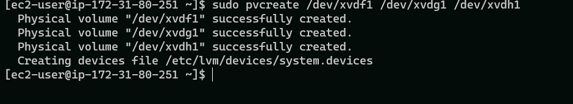

To verify that the Physical volume has been created successfully, I ran this command:

`sudo pvs`

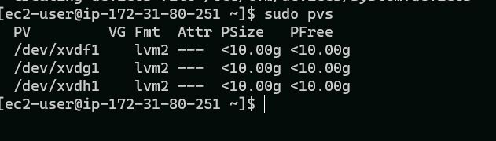

Next, I used the  *vgcreate utility* to add all 3 PVs to a volume group (VG). The VG was named *webdata-vg*

`sudo vgcreate webdata-vg /dev/xvdf1 /dev/xvdg1 /dev/xvdh1`

To verify that this was done successfully, I ran the command:

`sudo vgs`

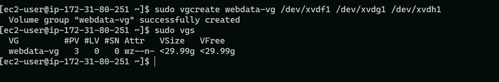

Next, I used teh *lvcreate utility* to create 2 logical volumes: **apps-lv** (using half of the PV size), and **logs-lv** (using the remaining space of the PV size), with the commands below:

`sudo lvcreate -n apps-lv -L 14G webdata-vg`

`sudo lvcreate -n logs-lv -L 14G webdata-vg`

To verify that the Logical Volumes has been created successfully, i ram the command below:

`sudo lvs`

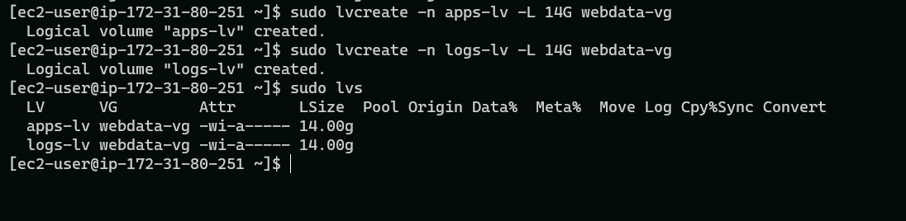

To verify the entire setup, I ran the following commands:

`sudo vgdisplay -v #view complete setup - VG, PV, and LV`

`sudo lsblk`

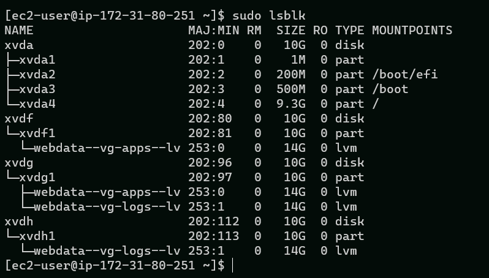

Next, I used *mkfs.ext4* to format the logical volumes with ext4 filesystem, using the commands below:

`sudo mkfs -t ext4 /dev/webdata-vg/apps-lv`

`sudo mkfs -t ext4 /dev/webdata-vg/logs-lv`

Next, I created */var/www/html* directory to store website files:

`sudo mkdir -p /var/www/html`

Also, I created /home/recovery/logs to store backup of log data

`sudo mkdir -p /home/recovery/logs`

Then, I mounted /var/www/html on apps-lv logical volume with the command below:

`sudo mount /dev/webdata-vg/apps-lv /var/www/html/`

Next, I used *rsync utility* to backup all the files in the log directory */var/log* into */home/recovery/logs* (This is required before mounting the file system)

`sudo rsync -av /var/log /home/recovery/logs/`

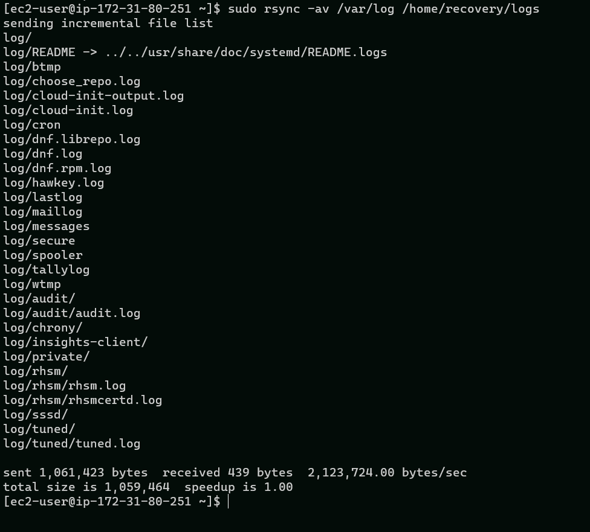

Next, I mounted /var/log on logs-lv logical volume

`sudo mount /dev/webdata-vg/logs-lv /var/log`

Next, restored log files back into /var/log directory using the command below:

`sudo rsync -av /home/recovery/logs/log/ /var/log`

Next, I run the command below to copy display and copy the block ID

`sudo blkid`

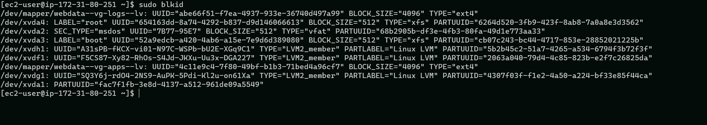

Then, I copied the UUID for /dev/mapper/webdata--vg-logs--lv and for /dev/mapper/webdata--vg-apps--lv on to a notepad

Next, I update */etc/fstab* file so that the mount configuration will persist after restart of the server. 

`sudo vi /etc/fstab`

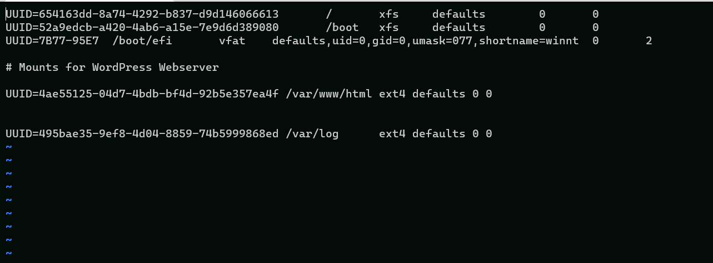

Next, I ran the following  commands to respectively est the configuration and reload the daemon:

`sudo mount -a`
 `sudo systemctl daemon-reload`

 Next, I verified my setup by running this command:

 `df -h`

 The output is displayed below:
 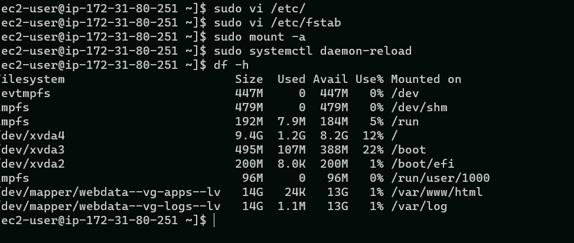

___
 ## **STEP 2 — PREPARING THE DATABASE SERVER**
 ___

