## PROJECT 6: Web Solution With WordPress

To begin with, I launched two EC2 instances using Redhat (not Ubuntu). One instance will serve as the 'Web Server' while the other will serve as the 'Database Server'.

___
## **STEP 1 — PREPARING THE WEB SERVER**
___

Firstly, I created 3 volumes in the same AZ (Availability Zone) as my Web Server EC2, each of 10 GiB and respectively name web1, web2 and web3.

Next, I attached all three volumes one by one to the Web Server EC2 instance, as displayed below:

From my webserver instance, I ran the command below to confirm that my volumes have been successfully attached:

`lsblk`

To see all (available) mount points and free space on my server, I ran this command:

`df -h`

The output is displayed below:

Next, I used the *gdisk* utility to create a single partition on each of the 3 disks, beginning with the first volume, using the command below:

`sudo gdisk /dev/xvdf`

The configuration is displayed below:

I repeated the last step for the *xvdg disk*, as below:

`sudo gdisk /dev/xvdg`

Similarly, the previous step was repeated the *xvdh disk*, as below:

`sudo gdisk /dev/xvdh`

Next, I used the *lsblk utility* to view the newly configured partition on each of the 3 disks. This is displayed below:

Next, I installed *lvm2* package using sudo yum install lvm2 by running the command below

`sudo yum install lvm2 -y`

To check for available partitions, I ran the command below:

`sudo lvmdiskscan`

The output is shown below:

Next, I used the *pvcreate* utility to mark each of 3 disks as physical volumes (PVs) to be used by LVM

`sudo pvcreate /dev/xvdf1 /dev/xvdg1 /dev/xvdh1`

To verify that the Physical volume has been created successfully, I ran this command:

`sudo pvs`

Next, I used the  *vgcreate utility* to add all 3 PVs to a volume group (VG). The VG was named *webdata-vg*

`sudo vgcreate webdata-vg /dev/xvdf1 /dev/xvdg1 /dev/xvdh1`

To verify that this was done successfully, I ran the command:

`sudo vgs`

Next, I used the *lvcreate utility* to create 2 logical volumes: **apps-lv** (using half of the PV size), and **logs-lv** (using the remaining space of the PV size), with the commands below:

`sudo lvcreate -n apps-lv -L 14G webdata-vg`

`sudo lvcreate -n logs-lv -L 14G webdata-vg`

To verify that the Logical Volumes has been created successfully, i ran the command below:

`sudo lvs`

To verify the entire setup, I ran the following commands:

`sudo vgdisplay -v #view complete setup - VG, PV, and LV`

`sudo lsblk`

Next, I used *mkfs.ext4* to format the logical volumes with ext4 filesystem, using the commands below:

`sudo mkfs.ext4 /dev/webdata-vg/apps-lv`

`sudo mkfs.ext4 /dev/webdata-vg/logs-lv`

Next, I created */var/www/html* directory to store website files:

`sudo mkdir -p /var/www/html`

Also, I created /home/recovery/logs to store backup of log data

`sudo mkdir -p /home/recovery/logs`

Then, I mounted /var/www/html on apps-lv logical volume with the command below:

`sudo mount /dev/webdata-vg/apps-lv /var/www/html/`

Next, I used *rsync utility* to backup all the files in the log directory */var/log* into */home/recovery/logs* (This is required before mounting the file system)

`sudo rsync -av /var/log /home/recovery/logs/`

Next, I mounted /var/log on logs-lv logical volume

`sudo mount /dev/webdata-vg/logs-lv /var/log`

Next, restored log files back into /var/log directory using the command below:

`sudo rsync -av /home/recovery/logs/log/ /var/log`

Next, I run the command below to copy display and copy the block ID

`sudo blkid`

Then, I copied the UUID for /dev/mapper/webdata--vg-logs--lv and for /dev/mapper/webdata--vg-apps--lv on to a notepad for proper formatting

Next, I update */etc/fstab* file so that the mount configuration will persist after restart of the server. 

`sudo vi /etc/fstab`

Next, I ran the following  commands to respectively est the configuration and reload the daemon:

`sudo mount -a`

 `sudo systemctl daemon-reload`

 Next, I verified my setup by running this command:

 `df -h`

 The output is displayed below:
 

___
 ## **STEP 2 — PREPARING THE DATABASE SERVER**
 ___

Firstly, after launching my EC2 instance for my Database Server, I created 3 volumes in the same AZ (Availability Zone) as my Database Server EC2, each of 10 GiB and respectively name db1, db2 and db3.

Next, I attached all three volumes one by one to the Database Server EC2 instance, as displayed below:

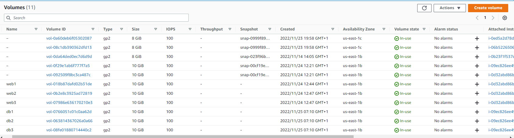

From my database server instance, I ran the command below to confirm that my volumes have been successfully attached:

`lsblk`

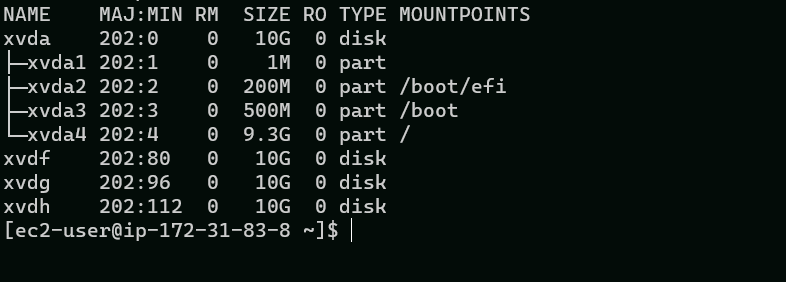

To see all (available) mount points and free space on my server, I ran this command:

`df -h`

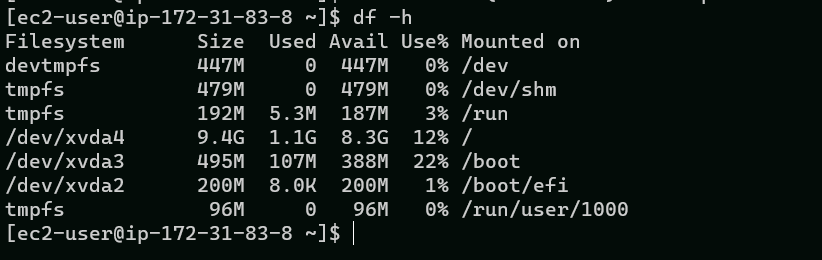

Next, I used the gdisk utility to create a single partition on each of the 3 disks, beginning with the first volume, using the command below:

`sudo gdisk /dev/xvdf`

`sudo gdisk /dev/xvdg`

`sudo gdisk /dev/xvdh`

Next, I used the lsblk utility to view the newly configured partition on each of the 3 disks. This is displayed below:

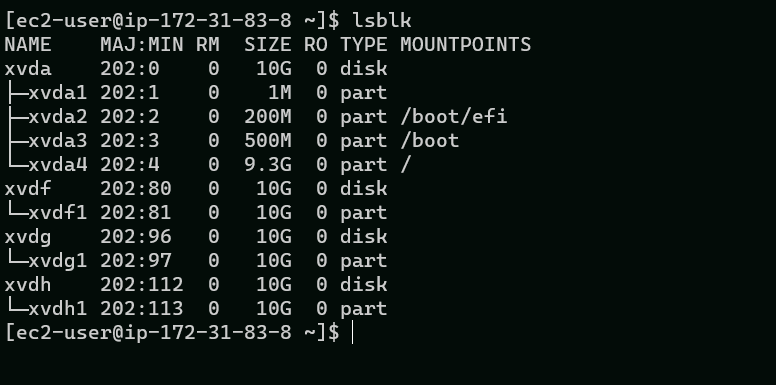

Next, I installed lvm2 package using sudo yum install lvm2 by running the command below:

`sudo yum install lvm2 -y`

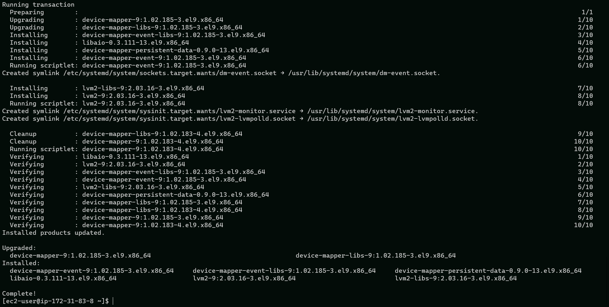

To check for available partitions, I ran the command below:

`sudo lvmdiskscan`

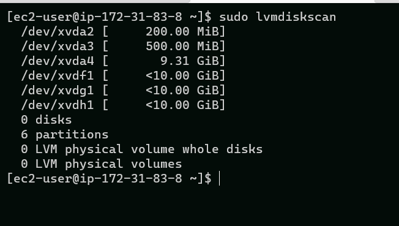

Next, I used the pvcreate utility to mark each of 3 disks as physical volumes (PVs) to be used by LVM

`sudo pvcreate /dev/xvdf1 /dev/xvdg1 /dev/xvdh1`

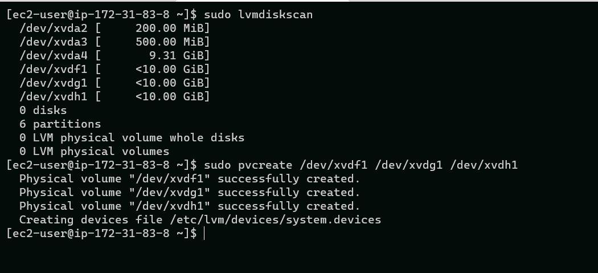

To verify that the Physical volume has been created successfully, I ran this command:

`sudo pvs`

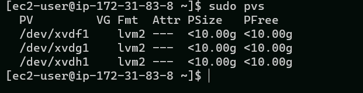

Next, I used the vgcreate utility to add all 3 PVs to a volume group (VG). The VG was named databasedata-vg

`sudo vgcreate databasedata-vg /dev/xvdf1 /dev/xvdg1 /dev/xvdh1`

To verify that this was done successfully, I ran the command:

`sudo vgs`

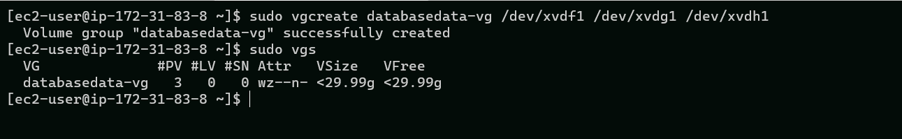

Next, I used the lvcreate utility to create a logical volume named *db-lv* with the commands below:

`sudo lvcreate -n db-lv -L 20G databasedata-vg`

To verify that the Logical Volume has been created successfully, i ran the command below:

`sudo lvs`

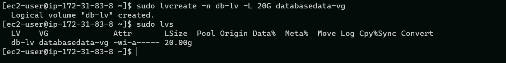

To verify the entire setup, I ran the following commands:

`sudo vgdisplay -v #view complete setup - VG, PV, and LV`

`sudo lsblk`

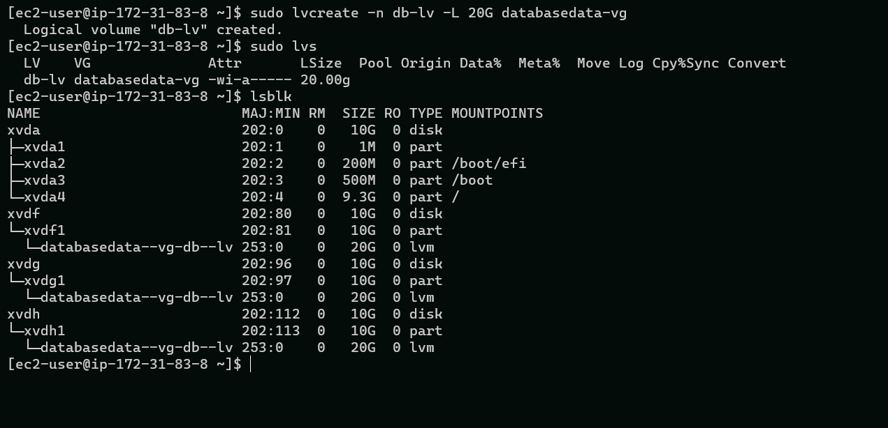

Next, I used mkfs.ext4 to format the logical volumes with ext4 filesystem, using the commands below:

`sudo mkfs.ext4 /dev/databasedata-vg/db-lv`

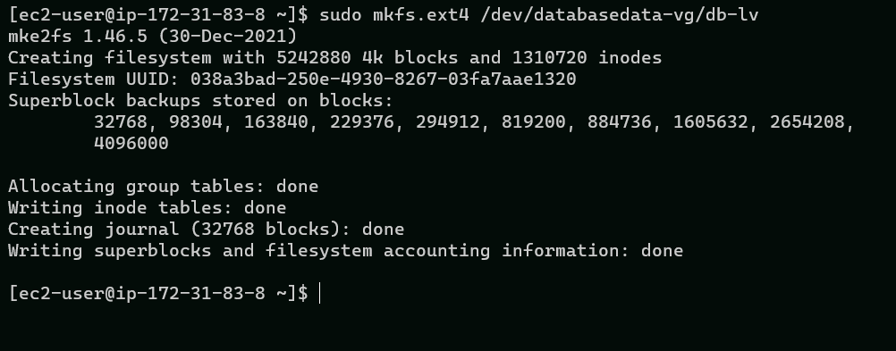

Next, I created /db directory to store website files:

`sudo mkdir /db`

Then, I mounted /db on db-lv logical volume with the command below:

`sudo mount /dev/databasedata-vg/db-lv /db`

Next, I run the command below to copy display and copy the block ID

`sudo blkid`

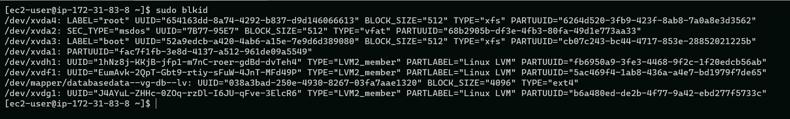

Then, I copied the UUID for /dev/mapper databasedata--vg-db--lv for proper formatting

Next, I update /etc/fstab file so that the mount configuration will persist after restart of the server.

`sudo vi /etc/fstab`

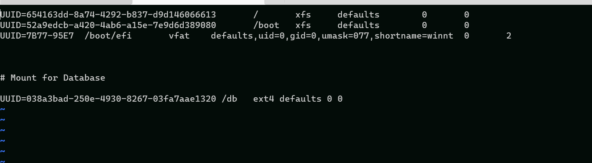

Next, I ran the following commands to respectively est the configuration and reload the daemon:

`sudo mount -a`

`sudo systemctl daemon-reload`

Next, I verified my setup by running this command:

`df -h`

The output is displayed below:

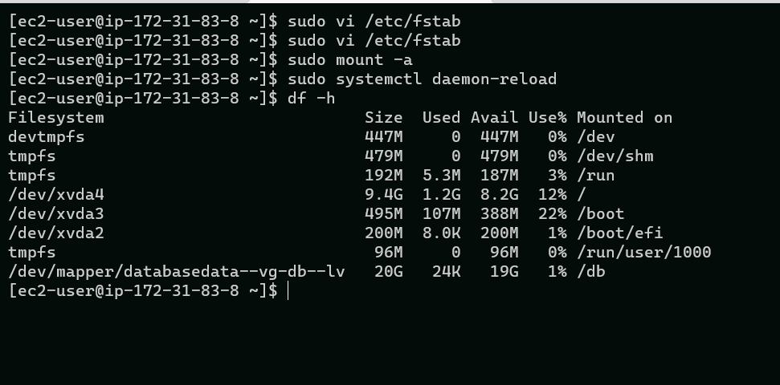

 ## **STEP 3 — INSTALLING WORDPRESS ON THE WEB SERVER EC2**

 Update the repository

 `sudo yum -y update`

 Install wget, Apache and it’s dependencies

 `sudo yum -y install wget httpd php php-mysqlnd php-fpm php-json`

 Start Apache

 `sudo systemctl enable httpd`
`sudo systemctl start httpd`

Next, install PHP and it’s dependencies

`sudo yum install https://dl.fedoraproject.org/pub/epel/epel-release-latest-8.noarch.rpm`

`sudo yum install yum-utils http://rpms.remirepo.net/enterprise/remi-release-8.rpm -y`

`sudo yum module list php`

`sudo yum module reset php`

`sudo yum module enable php:remi-7.4`

`sudo yum install php php-opcache php-gd php-curl php-mysqlnd`

`sudo systemctl start php-fpm`

`sudo systemctl enable php-fpm`

`sudo setsebool -P httpd_execmem 1`

Next, restart Apache

`sudo systemctl restart httpd`

Download wordpress and copy wordpress to var/www/html

`mkdir wordpress`

  `cd wordpress`

  `sudo wget http://wordpress.org/latest.tar.gz`

  `sudo tar xzvf latest.tar.gz`

 `sudo rm -rf latest.tar.gz`

  `sudo cp wordpress/wp-config-sample.php wordpress/wp-config.php`

  `sudo cp -R wordpress/. /var/www/html/`

  Configure SELinux Policies

  ## **STEP 4 — INSTALLING WMYSQL ON THE DATABASE SERVER EC2**

`sudo yum update`
`sudo yum install mysql-server -y`

Verify that the service is up and running by using `sudo systemctl status mysqld`, if it is not running, restart the service and enable it so it will be running even after reboot:

`sudo systemctl restart mysqld`
`sudo systemctl enable mysqld`

The status is displayed below:

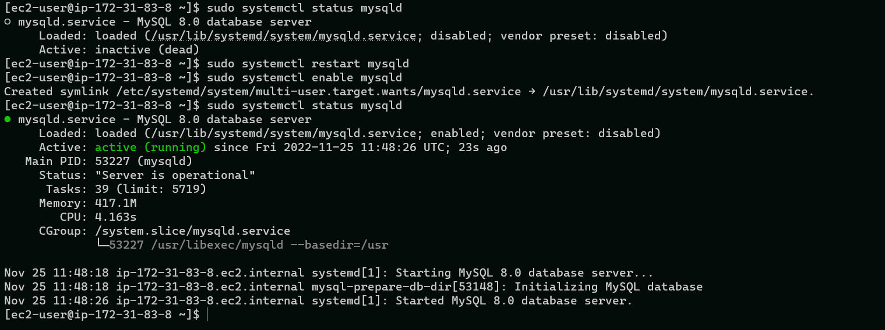

## **STEP 5  — CONFIGURING DATABASE SERVER TO WORK WITH WORDPRESS**

`sudo mysql_secure_installation`

`sudo mysql -u root -p`

`sudo mysql`

`CREATE DATABASE wordpress;`

`CREATE USER `wordpress`@`<Web-Server-Private-IP-Address>` IDENTIFIED BY 'mypassword';`

GRANT ALL ON wordpress.* TO 'myuser'@'<Web-Server-Private-IP-Address>';

`FLUSH PRIVILEGES;`

`SHOW DATABASES;`

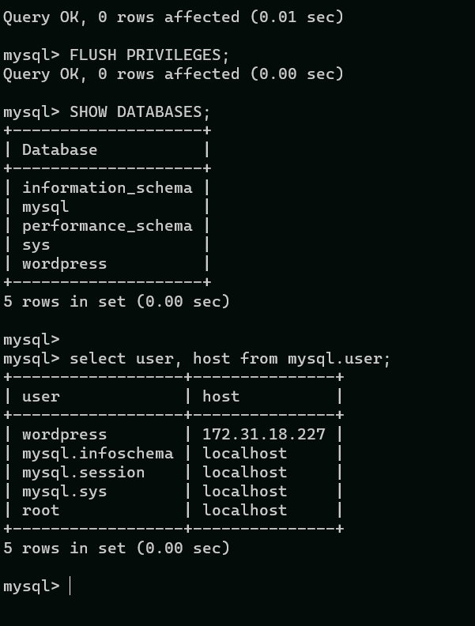

`exit`

On the webserver EC2 intance 

cd to /var/www/htmh

`sudo vi wp-config.php`

Edit the configuration file  as shown below

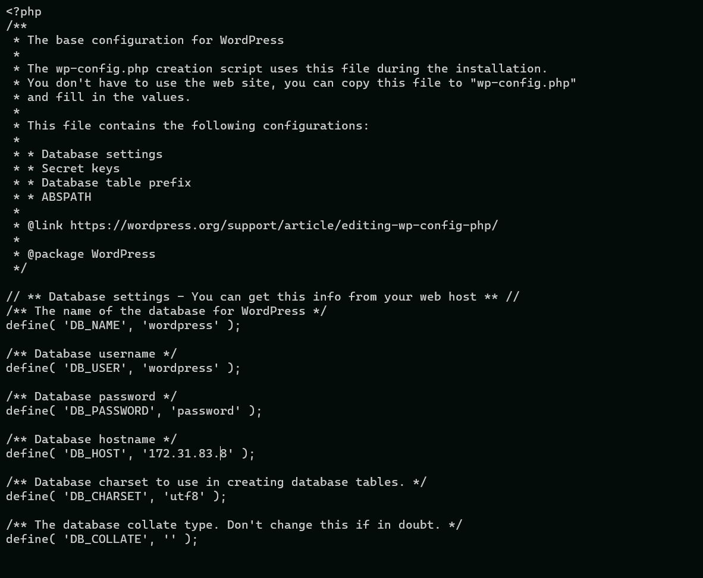

rename(disable apache)

`sudo mv /etc/httpd/conf.d/welcome.conf /etc/httpd/conf.d/welcome.conf_backup`

## **STEP 6  — CONFIGURING WORDPRESS TO REMOTE DATABASE SERVER**
 I opened MySQL port 3306 on DB Server EC2. For extra security, I allowed access to the DB server ONLY from the Web Server’s IP address, so in the Inbound Rule configuration I specified source as /32

1. Install MySQL client and test that you can connect from your Web Server to your DB server by using mysql-client

    `sudo mysql -h 172.31.83.8 -u wordpress -p`

2. Verify if you can successfully execute SHOW DATABASES; command and see a list of existing databases.

    `SHOW DATABSES`

    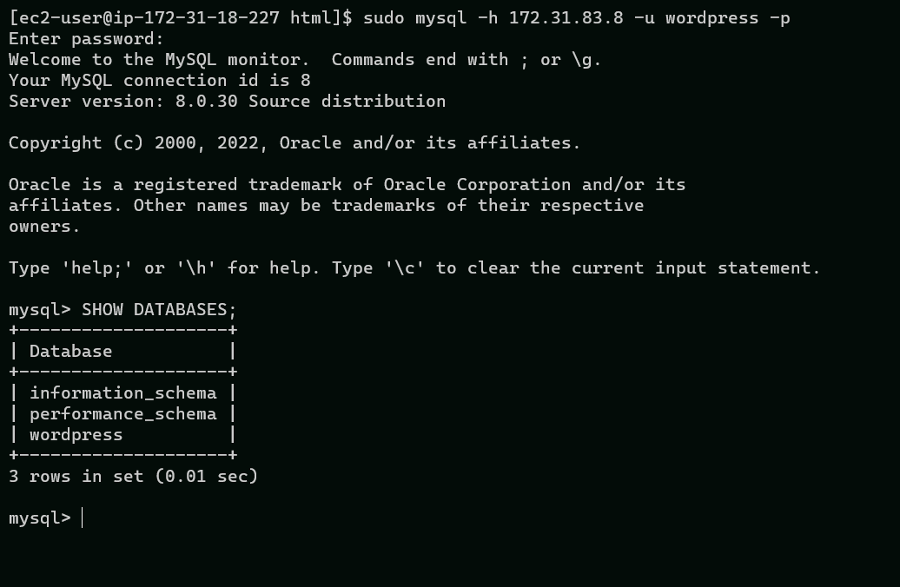

3. Change permissions and configuration so Apache could use WordPress:

    `sudo chown -R apache:apache /var/www/html/`

    `sudo chcon -t httpd_sys_rw_content_t /var/www/html/ -R`

    `sudo setsebool -P httpd_can_network_connect=1`

4. Enable TCP port 80 in Inbound Rules configuration for the Web Server EC2 (enable from everywhere 0.0.0.0/0 or from your workstation’s IP)

5. I then accessed,from my browser the link to my WordPress http://<Web-Server-Public-IP-Address>, as shown below:

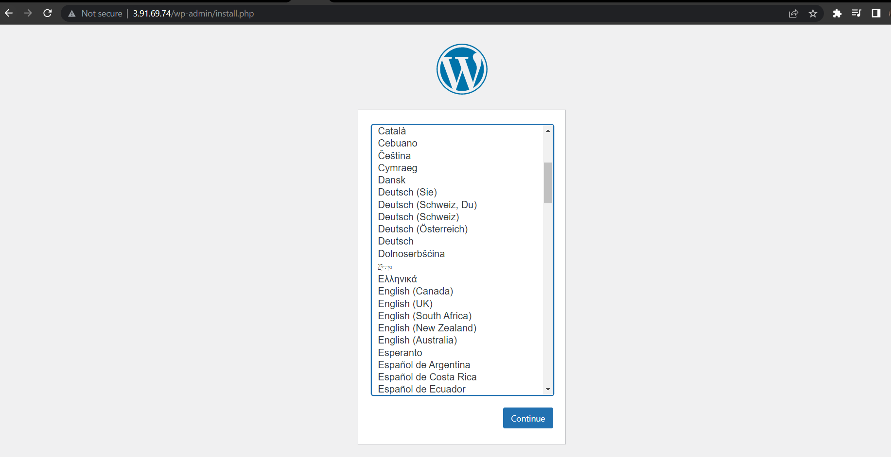

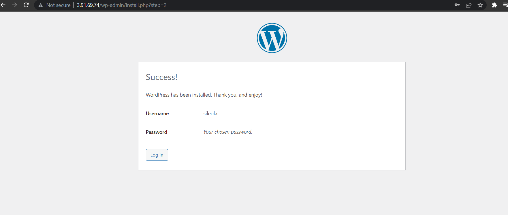

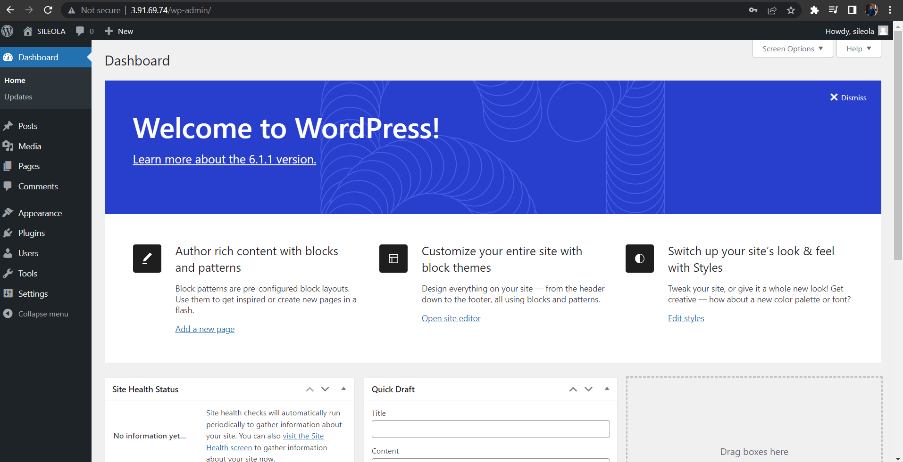

## **THIS IS THE END OF PROJECT 6**